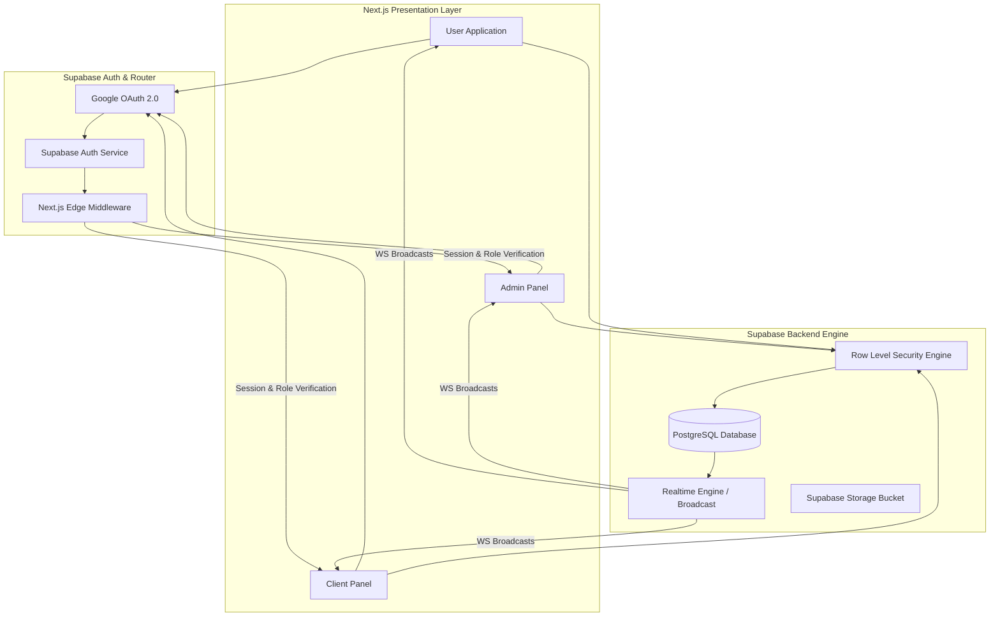
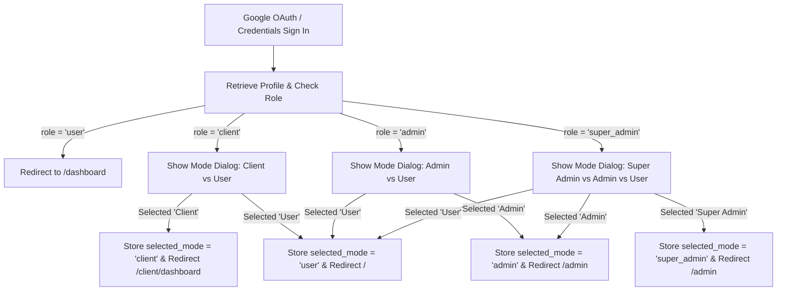
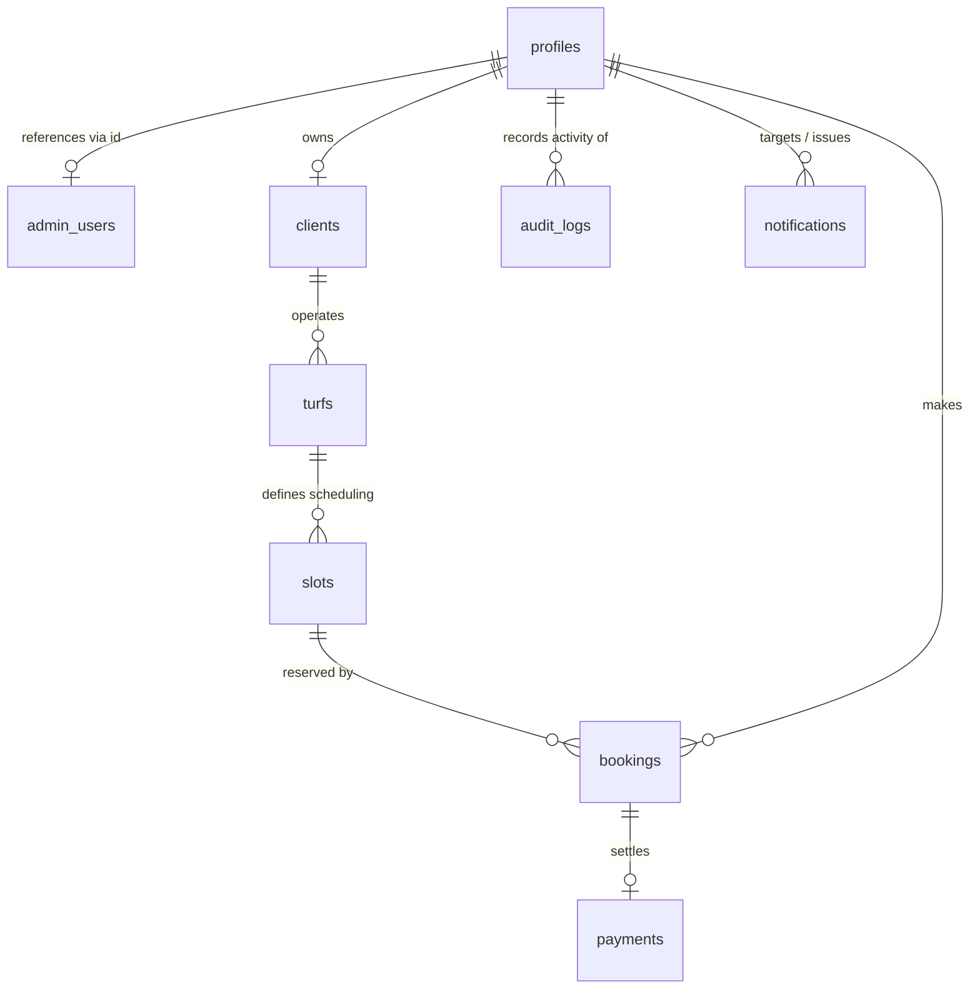
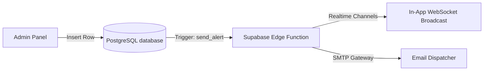

# PlayTurf Admin & Client Panel Architecture Documentation

Welcome to the **PlayTurf** codebase documentation. This document provides a comprehensive technical overview of the PlayTurf system architecture, database design, Role-Based Access Control (RBAC), Row-Level Security (RLS) policies, security model, frontend/backend modules, and deployment workflows.

---

## 1. System Architecture

PlayTurf is engineered using a modern serverless architecture, decoupling the client-side presentation layer from data persistence and backend operations. The application is built on top of React/Next.js and leverages Supabase as its Backend-as-a-Service (BaaS).

### Architecture Diagram



### Flow Diagram: Authentication & Authorization Flow

```mermaid
sequenceDiagram
    autonumber
    actor User as Client / Admin / User
    participant App as Next.js Frontend
    participant Auth as Supabase Auth
    participant DB as PostgreSQL Database
    participant Middleware as Next.js Middleware

    User->>App: Click "Login with Google"
    App->>Auth: Initiate OAuth Flow (signInWithOAuth)
    Auth->>User: Redirect to Google Consent Screen
    User->>Auth: Grant Permissions & Redirect back
    Auth->>App: Return JWT & Session Tokens
    Auth->>DB: Trigger: on_auth_user_created (Profile generation)
    
    rect rgb(20, 20, 30)
        Note over App, Middleware: Navigation Route Check
        App->>Middleware: Access Protected Route (/admin/*, /client/*)
        Middleware->>Auth: Retrieve & Verify JWT Session
        alt JWT Invalid or Expired
            Middleware->>App: Redirect to /login
        else JWT Valid
            Middleware->>DB: Query profile.role for verified user ID
            DB->>Middleware: Return user role (e.g., 'client', 'admin')
            alt Role Authorized
                Middleware->>App: Allow render requested page
            else Role Unauthorized
                Middleware->>App: Redirect to /unauthorized
            end
        end
    end
```



### Core Architecture Components

1. **Frontend Architecture (React / Next.js)**:
   - Uses the App Router layout paradigm to segregate User, Client, and Admin UI contexts.
   - Global state is handled via React Context and lightweight hooks for auth status.
   - Client-side data fetching utilizes the Supabase JS client with cache revalidation triggers.

2. **Backend Architecture (Supabase / PostgreSQL)**:
   - Supabase handles Authentication (Google Provider), file storage (Turf images, feedback screenshots), and database hosting.
   - Database level constraints, triggers, and functions run inside PostgreSQL to handle overlap checks, auditing, and realtime event triggers.

3. **Real-time & Notifications**:
   - PostgreSQL triggers capture mutations on the `bookings` table and push changes out via Supabase Realtime using WebSockets (`realtime.messages`).
   - Listeners update slot schedules instantly across customer applications when admins or clients book/cancel slots.

---

## 2. Role Based Access Control (RBAC)

PlayTurf enforces a strict hierarchical RBAC design. Roles are assigned at profile creation and validated at both the Next.js Middleware boundary and the Database RLS layer.

| Feature / Permission | Super Admin | Admin | Client (Turf Owner) | User (Customer) |
| :--- | :---: | :---: | :---: | :---: |
| **Manage Admins** | ✓ | ✗ | ✗ | ✗ |
| **Manage Clients / Vendors** | ✓ | ✓ | ✗ | ✗ |
| **Manage Core App Settings** | ✓ | ✗ | ✗ | ✗ |
| **View System Audit Logs** | ✓ | ✗ | ✗ | ✗ |
| **Configure System-wide Fees** | ✓ | ✗ | ✗ | ✗ |
| **Manage All Turfs** | ✓ | ✓ | ✗ | ✗ |
| **Manage Own Turfs** | ✓ | ✓ | ✓ | ✗ |
| **Manage Slot Timings & Pricing** | ✓ | ✓ | ✓ | ✗ |
| **Book & Manage Slots** | ✓ | ✓ | ✓ | ✓ |
| **Access Operational Analytics** | ✓ | ✓ | ✗ | ✗ |
| **Access Own Revenue Analytics** | ✓ | ✓ | ✓ | ✗ |
| **Submit Reviews** | ✗ | ✗ | ✗ | ✓ |
| **Manage Personal Profile** | ✓ | ✓ | ✓ | ✓ |

### Role Definitions & Restrictions

1. **Super Admin**: System owner with total read, write, and execute permissions. Only Super Admins can transition the application into Maintenance Mode or alter system-wide variables.
2. **Admin**: Operational staff. Can verify turf details, handle standard client onboardings, check payments, and issue general announcements. Cannot manage Super Admin accounts or mutate fundamental configurations.
3. **Client (Turf Owner)**: Business partner managing a subset of turfs. Permissions are strictly isolated to resources linked to their `client_id`. They cannot view records from other turf clients.
4. **User (Customer)**: Public consumers. Can explore listed turfs, submit slot reservations, pay invoices, rate venues, and manage personal schedules. No dashboard access.

---

## 3. Multi-Role Login Flow

To support administrative and vendor personas who also need to book turfs as customers, PlayTurf implements a dynamic Multi-Role Selection workflow post-login.

### Flow Diagram



### Access Modes & Redirect Patterns

* **User (`user`)**: Bypass select screen. Directly routes to `/` (User Dashboard).
* **Client (`client`)**: Choices are `Continue as Client` (routes to `/client/dashboard`) and `Continue as User` (routes to `/`).
* **Admin (`admin`)**: Choices are `Continue as Admin` (routes to `/admin`) and `Continue as User` (routes to `/`).
* **Super Admin (`super_admin`)**: Choices are `Continue as Super Admin` (routes to `/admin`), `Continue as Admin` (routes to `/admin`), and `Continue as User` (routes to `/`).

### Session Storage Strategy

On option selection, the client app stores the selection in browser session state:
```javascript
sessionStorage.setItem("selected_mode", "admin"); // 'super_admin', 'admin', 'client', or 'user'
```
This state decides whether to display management controls or consumer-focused navigation bars during their current browser session.

> [!IMPORTANT]
> The popup selection only influences visual client-side panels and layout wrappers. Permissions are protected at the database RLS policies and server-side Edge Middleware validations based on the authenticated profile's underlying `role` definition (`super_admin`, `admin`, `client`), preventing privilege escalations even if a user manipulates their session state.

---

## 4. Database Design

The database schema utilizes relational constraints and UUID mapping against Supabase Auth schemas.



### Table Schema Definitions

#### Table: `profiles`
Stores master profile details for all identity types. Integrates with the Supabase Auth metadata.
```sql
CREATE TABLE public.profiles (
    id uuid PRIMARY KEY REFERENCES auth.users(id) ON DELETE CASCADE,
    email text UNIQUE NOT NULL,
    full_name text NOT NULL,
    role text NOT NULL CHECK (role IN ('super_admin', 'admin', 'client', 'user')) DEFAULT 'user',
    phone varchar(10),
    avatar_url text,
    status text NOT NULL CHECK (status IN ('active', 'suspended', 'pending')) DEFAULT 'active',
    created_at timestamp with time zone DEFAULT timezone('utc'::text, now()) NOT NULL,
    updated_at timestamp with time zone DEFAULT timezone('utc'::text, now()) NOT NULL
);
```

#### Table: `admin_users`
Tracks specific admin access rights and tracking attributes.
```sql
CREATE TABLE public.admin_users (
    id uuid PRIMARY KEY REFERENCES public.profiles(id) ON DELETE CASCADE,
    email text UNIQUE NOT NULL,
    role text NOT NULL CHECK (role IN ('super_admin', 'admin')),
    is_active boolean DEFAULT true NOT NULL,
    created_at timestamp with time zone DEFAULT timezone('utc'::text, now()) NOT NULL
);
```

#### Table: `clients`
Captures commercial business metadata for turf operators.
```sql
CREATE TABLE public.clients (
    id uuid DEFAULT gen_random_uuid() PRIMARY KEY,
    user_id uuid NOT NULL REFERENCES public.profiles(id) ON DELETE CASCADE UNIQUE,
    business_name text NOT NULL,
    gst_number text NOT NULL,
    status text NOT NULL CHECK (status IN ('pending_approval', 'approved', 'suspended')) DEFAULT 'pending_approval',
    created_at timestamp with time zone DEFAULT timezone('utc'::text, now()) NOT NULL
);
```

#### Table: `turfs`
Maintains records for physical sports grounds.
```sql
CREATE TABLE public.turfs (
    id uuid DEFAULT gen_random_uuid() PRIMARY KEY,
    client_id uuid NOT NULL REFERENCES public.clients(id) ON DELETE CASCADE,
    name text NOT NULL,
    description text,
    sport_type text[] NOT NULL DEFAULT '{}',
    city text NOT NULL,
    state text NOT NULL,
    address text NOT NULL,
    latitude double precision,
    longitude double precision,
    images text[] DEFAULT '{}'::text[] NOT NULL,
    status text NOT NULL CHECK (status IN ('active', 'inactive', 'under_maintenance')) DEFAULT 'active',
    created_at timestamp with time zone DEFAULT timezone('utc'::text, now()) NOT NULL
);
```

#### Table: `slots`
Represents the default booking slot definitions.
```sql
CREATE TABLE public.slots (
    id uuid DEFAULT gen_random_uuid() PRIMARY KEY,
    turf_id uuid NOT NULL REFERENCES public.turfs(id) ON DELETE CASCADE,
    date date NOT NULL,
    start_time time without time zone NOT NULL,
    end_time time without time zone NOT NULL,
    price numeric(10,2) NOT NULL CHECK (price >= 0),
    availability boolean DEFAULT true NOT NULL,
    CONSTRAINT chk_times CHECK (start_time < end_time)
);
```

#### Table: `bookings`
Links clients, turfs, slots, and customers.
```sql
CREATE TABLE public.bookings (
    id uuid DEFAULT gen_random_uuid() PRIMARY KEY,
    user_id uuid NOT NULL REFERENCES public.profiles(id) ON DELETE CASCADE,
    turf_id uuid NOT NULL REFERENCES public.turfs(id) ON DELETE CASCADE,
    slot_id uuid NOT NULL REFERENCES public.slots(id) ON DELETE CASCADE,
    booking_status text NOT NULL CHECK (booking_status IN ('pending', 'confirmed', 'cancelled', 'expired')) DEFAULT 'pending',
    payment_status text NOT NULL CHECK (payment_status IN ('unpaid', 'paid', 'refunded')) DEFAULT 'unpaid',
    amount numeric(10,2) NOT NULL CHECK (amount >= 0),
    created_at timestamp with time zone DEFAULT timezone('utc'::text, now()) NOT NULL
);
```

#### Table: `payments`
Details transactions matching individual bookings.
```sql
CREATE TABLE public.payments (
    id uuid DEFAULT gen_random_uuid() PRIMARY KEY,
    booking_id uuid NOT NULL REFERENCES public.bookings(id) ON DELETE CASCADE UNIQUE,
    transaction_id text UNIQUE NOT NULL,
    amount numeric(10,2) NOT NULL CHECK (amount >= 0),
    status text NOT NULL CHECK (status IN ('success', 'failed', 'refunded')) DEFAULT 'success',
    payment_method text NOT NULL,
    created_at timestamp with time zone DEFAULT timezone('utc'::text, now()) NOT NULL
);
```

#### Table: `offers`
Promo codes and promotional materials.
```sql
CREATE TABLE public.offers (
    id uuid DEFAULT gen_random_uuid() PRIMARY KEY,
    title text NOT NULL,
    description text,
    discount numeric(5,2) NOT NULL CHECK (discount > 0 AND discount <= 100), -- Percentage discount
    start_date date NOT NULL,
    end_date date NOT NULL,
    created_by uuid REFERENCES public.profiles(id) ON DELETE SET NULL,
    CONSTRAINT chk_dates CHECK (start_date <= end_date)
);
```

#### Table: `notifications`
System alerts for targeted audiences.
```sql
CREATE TABLE public.notifications (
    id uuid DEFAULT gen_random_uuid() PRIMARY KEY,
    title text NOT NULL,
    message text NOT NULL,
    type text NOT NULL CHECK (type IN ('system', 'promotion', 'booking_status')),
    target_audience text NOT NULL CHECK (target_audience IN ('all', 'admins', 'clients', 'users')),
    created_by uuid REFERENCES public.profiles(id) ON DELETE SET NULL,
    created_at timestamp with time zone DEFAULT timezone('utc'::text, now()) NOT NULL
);
```

#### Table: `audit_logs`
Automated change capture logs tracking user mutation actions.
```sql
CREATE TABLE public.audit_logs (
    id uuid DEFAULT gen_random_uuid() PRIMARY KEY,
    user_id uuid REFERENCES public.profiles(id) ON DELETE SET NULL,
    action text NOT NULL,
    table_name text NOT NULL,
    record_id uuid,
    old_value jsonb,
    new_value jsonb,
    created_at timestamp with time zone DEFAULT timezone('utc'::text, now()) NOT NULL
);
```

#### Table: `settings`
Core platform-wide configuration parameter.
```sql
CREATE TABLE public.settings (
    id integer PRIMARY KEY DEFAULT 1 CONSTRAINT only_one_row CHECK (id = 1),
    maintenance_mode boolean DEFAULT false NOT NULL,
    app_version text DEFAULT '1.0.0' NOT NULL,
    booking_limit integer DEFAULT 10 NOT NULL,
    created_at timestamp with time zone DEFAULT timezone('utc'::text, now()) NOT NULL
);
```

---

## 5. SQL Scripts & Schema Migration

Execute these PostgreSQL scripts inside your Supabase SQL Editor. This includes index creations, primary constraints, triggers, and stored procedures.

### Primary Keys & Key Indexes
```sql
-- Indexes to speed up queries on foreign keys and commonly filtered columns
CREATE INDEX IF NOT EXISTS idx_turfs_client_id ON public.turfs(client_id);
CREATE INDEX IF NOT EXISTS idx_slots_turf_date ON public.slots(turf_id, date);
CREATE INDEX IF NOT EXISTS idx_bookings_user_id ON public.bookings(user_id);
CREATE INDEX IF NOT EXISTS idx_bookings_turf_slot ON public.bookings(turf_id, slot_id);
CREATE INDEX IF NOT EXISTS idx_payments_booking_id ON public.payments(booking_id);
CREATE INDEX IF NOT EXISTS idx_audit_logs_record ON public.audit_logs(table_name, record_id);
```

### Booking Integrity Constraints & Expiry Functionality
To prevent overlapping double bookings, we introduce a transaction check mechanism.
```sql
-- Function to cancel pending bookings older than 15 minutes
CREATE OR REPLACE FUNCTION public.expire_pending_bookings()
RETURNS void
LANGUAGE plpgsql
AS $$
BEGIN
    UPDATE public.bookings
    SET booking_status = 'expired'
    WHERE booking_status = 'pending'
      AND created_at < timezone('utc'::text, now()) - interval '15 minutes';
END;
$$;
```

---

## 6. Supabase Authentication

PlayTurf manages authentication natively via Supabase using Google OAuth 2.0.

### Google Login Implementation (Next.js client)

Create a custom authentication client file:

```typescript
// lib/auth-client.ts
import { createClientComponentClient } from '@supabase/auth-helpers-nextjs';

export const supabase = createClientComponentClient();

export async function loginWithGoogle() {
  const { error } = await supabase.auth.signInWithOAuth({
    provider: 'google',
    options: {
      redirectTo: `${window.location.origin}/auth/callback`,
      queryParams: {
        access_type: 'offline',
        prompt: 'consent',
      },
    },
  });

  if (error) {
    console.error('Google Sign In Error:', error.message);
    throw error;
  }
}

export async function logoutUser() {
  const { error } = await supabase.auth.signOut();
  if (error) {
    console.error('Sign Out Error:', error.message);
  }
}
```

### PostgreSQL Trigger: Automatic Profile Generation
When a new user logs in through Google OAuth, Supabase adds a row to `auth.users`. We hook into this insert event to generate a database `profile` entry.

```sql
CREATE OR REPLACE FUNCTION public.handle_new_user()
RETURNS trigger AS $$
BEGIN
  INSERT INTO public.profiles (id, email, full_name, role, avatar_url, status)
  VALUES (
    new.id,
    new.email,
    COALESCE(new.raw_user_meta_data->>'full_name', 'PlayTurf Player'),
    'user',
    new.raw_user_meta_data->>'avatar_url',
    'active'
  );
  RETURN new;
END;
$$ LANGUAGE plpgsql SECURITY DEFINER;

-- Trigger to execute handle_new_user on insert into auth.users
CREATE OR REPLACE TRIGGER on_auth_user_created
  AFTER INSERT ON auth.users
  FOR EACH ROW EXECUTE FUNCTION public.handle_new_user();
```

---

## 7. Route Protection & Middleware

We intercept requests at the server edge using Next.js Middleware. The middleware verifies session integrity and fetches the profile's role to block unauthorized navigation.

### Middleware Implementation (`middleware.ts`)

```typescript
// middleware.ts
import { createMiddlewareClient } from '@supabase/auth-helpers-nextjs';
import { NextResponse } from 'next/server';
import type { NextRequest } from 'next/server';

export async function middleware(req: NextRequest) {
  const res = NextResponse.next();
  const supabase = createMiddlewareClient({ req, res });
  
  // Refresh session if expired
  const { data: { session } } = await supabase.auth.getSession();

  const url = req.nextUrl.clone();
  const path = url.pathname;

  // Protect Admin dashboard routes
  if (path.startsWith('/admin')) {
    if (!session) {
      url.pathname = '/login';
      return NextResponse.redirect(url);
    }
    
    // Fetch profile role from DB
    const { data: profile } = await supabase
      .from('profiles')
      .select('role')
      .eq('id', session.user.id)
      .single();

    if (!profile || (profile.role !== 'admin' && profile.role !== 'super_admin')) {
      url.pathname = '/unauthorized';
      return NextResponse.redirect(url);
    }
  }

  // Protect Client panel routes
  if (path.startsWith('/client')) {
    if (!session) {
      url.pathname = '/login';
      return NextResponse.redirect(url);
    }

    const { data: profile } = await supabase
      .from('profiles')
      .select('role')
      .eq('id', session.user.id)
      .single();

    if (!profile || (profile.role !== 'client' && profile.role !== 'admin' && profile.role !== 'super_admin')) {
      url.pathname = '/unauthorized';
      return NextResponse.redirect(url);
    }
  }

  // Protect Customer Dashboard routes
  if (path.startsWith('/dashboard')) {
    if (!session) {
      url.pathname = '/login';
      return NextResponse.redirect(url);
    }
  }

  return res;
}

export const config = {
  matcher: ['/admin/:path*', '/client/:path*', '/dashboard/:path*'],
};
```

---

## 8. Row Level Security (RLS) Policies

To ensure database compliance and resource isolation, RLS is active on all operational tables.

```sql
-- Enable RLS on core tables
ALTER TABLE public.profiles ENABLE ROW LEVEL SECURITY;
ALTER TABLE public.clients ENABLE ROW LEVEL SECURITY;
ALTER TABLE public.turfs ENABLE ROW LEVEL SECURITY;
ALTER TABLE public.slots ENABLE ROW LEVEL SECURITY;
ALTER TABLE public.bookings ENABLE ROW LEVEL SECURITY;
ALTER TABLE public.payments ENABLE ROW LEVEL SECURITY;
```

### Policy: Profile Management
```sql
CREATE POLICY "Profiles are readable by owners and administrators" 
  ON public.profiles FOR SELECT 
  USING (auth.uid() = id OR EXISTS (
    SELECT 1 FROM public.profiles WHERE id = auth.uid() AND role IN ('admin', 'super_admin')
  ));

CREATE POLICY "Profiles are updatable only by account owners" 
  ON public.profiles FOR UPDATE 
  USING (auth.uid() = id);
```

### Policy: Client Isolation
```sql
CREATE POLICY "Clients can view their own details" 
  ON public.clients FOR SELECT 
  USING (auth.uid() = user_id OR EXISTS (
    SELECT 1 FROM public.profiles WHERE id = auth.uid() AND role IN ('admin', 'super_admin')
  ));

CREATE POLICY "Clients can update their own profile details" 
  ON public.clients FOR UPDATE 
  USING (auth.uid() = user_id);
```

### Policy: Turf Management
```sql
CREATE POLICY "Turfs are viewable by everyone" 
  ON public.turfs FOR SELECT 
  USING (true);

CREATE POLICY "Clients can manage their own turfs" 
  ON public.turfs FOR ALL 
  USING (
    client_id IN (SELECT id FROM public.clients WHERE user_id = auth.uid()) 
    OR EXISTS (
      SELECT 1 FROM public.profiles WHERE id = auth.uid() AND role IN ('admin', 'super_admin')
    )
  );
```

### Policy: Booking Restraints
```sql
CREATE POLICY "Users can view their own bookings" 
  ON public.bookings FOR SELECT 
  USING (
    auth.uid() = user_id 
    OR turf_id IN (
      SELECT id FROM public.turfs WHERE client_id IN (
        SELECT id FROM public.clients WHERE user_id = auth.uid()
      )
    )
    OR EXISTS (
      SELECT 1 FROM public.profiles WHERE id = auth.uid() AND role IN ('admin', 'super_admin')
    )
  );

CREATE POLICY "Users can create bookings under their own user_id" 
  ON public.bookings FOR INSERT 
  WITH CHECK (auth.uid() = user_id);
```

---

## 9. Admin Panel Modules

The Admin Panel (`/admin/*`) is the central portal for global platform operators.

### 8.1 Dashboard
* **Purpose**: High-level platform health reporting.
* **Features**: Live metrics (Daily Active Users, Revenue charts, active bookings count).
* **Database Tables**: `bookings`, `payments`, `profiles`.
* **Permissions**: Admins, Super Admins.
* **UI Components**: Metric cards, line graphs (recharts), live alert streams.

### 8.2 User Management
* **Purpose**: Oversee client and player profiles.
* **Features**: Search/filter users, toggle active status, suspend accounts.
* **Database Tables**: `profiles`.
* **Permissions**: Admins, Super Admins.
* **UI Components**: Data table with paginators, action modals for account suspension.

### 8.3 Client Management
* **Purpose**: Manage business partner registration.
* **Features**: Review client applications, check GST logs, approve or freeze vendors.
* **Database Tables**: `clients`, `profiles`.
* **Permissions**: Admins, Super Admins.
* **UI Components**: Pending request badges, verification sliders, attachment viewers.

### 8.4 Turf Management
* **Purpose**: Supervise listings.
* **Features**: Modify any turf description, toggle validation flags, deactivate noisy turfs.
* **Database Tables**: `turfs`, `clients`.
* **Permissions**: Admins, Super Admins.
* **UI Components**: Grid layouts of turf listings, custom filtering tags.

### 8.5 Booking Management
* **Purpose**: Conflict resolution.
* **Features**: View all booking pipelines, perform manual overrides, adjust cancellations.
* **Database Tables**: `bookings`, `slots`.
* **Permissions**: Admins, Super Admins.
* **UI Components**: Schedule calendar block view, cancellation action prompts.

### 8.6 Payment Management
* **Purpose**: Track financial integrity.
* **Features**: Inspect payment statuses, verify transaction references, initiate manual refund pipelines.
* **Database Tables**: `payments`, `bookings`.
* **Permissions**: Admins, Super Admins.
* **UI Components**: Transaction logs table, exports to CSV triggers.

### 8.7 Offer Management
* **Purpose**: Market campaigns.
* **Features**: Create system-wide promo banners, schedule dates, assign discount rates.
* **Database Tables**: `offers`.
* **Permissions**: Admins, Super Admins.
* **UI Components**: Form builder, dynamic discount sliders.

### 8.8 Notification Center
* **Purpose**: Send mass updates.
* **Features**: Draft system notification banners, choose target audience, issue alerts.
* **Database Tables**: `notifications`.
* **Permissions**: Admins, Super Admins.
* **UI Components**: Markdown text fields, target selector checkmarks.

### 8.9 Analytics
* **Purpose**: Business intelligence forecasting.
* **Features**: Month-over-month profit reports, popular sport filters, customer drop-off metrics.
* **Database Tables**: `bookings`, `payments`, `turfs`.
* **Permissions**: Admins, Super Admins.
* **UI Components**: Advanced pie charts, demographic heatmaps.

### 8.10 Audit Logs
* **Purpose**: Security auditing.
* **Features**: Track administrative database updates. Read-only log.
* **Database Tables**: `audit_logs`.
* **Permissions**: Super Admins.
* **UI Components**: Log timeline list, search inputs for user UUIDs.

### 8.11 Settings
* **Purpose**: Configuration management.
* **Features**: Toggle maintenance flags, configure concurrent booking limit boundaries.
* **Database Tables**: `settings`.
* **Permissions**: Super Admins.
* **UI Components**: Switch toggles, numeric inputs.

---

## 10. Client Panel Modules

The Client Panel (`/client/*`) is optimized for individual turf owners.

### 9.1 Dashboard
* **Purpose**: Quick venue status check.
* **Features**: Today's booking summaries, slot occupancy, quick statistics.
* **Database Tables**: `bookings`, `turfs`.
* **Permissions**: Approved Clients.
* **UI Components**: Simple calendar cards, booking status feeds.

### 9.2 Turf Management
* **Purpose**: Configure turf listings.
* **Features**: Edit descriptions, upload image galleries to Supabase Storage, modify sport tags.
* **Database Tables**: `turfs`.
* **Permissions**: Approved Clients.
* **UI Components**: Multi-image drag and drop cards, text editor blocks.

### 9.3 Slot Management
* **Purpose**: Schedule slot availability.
* **Features**: Set default slots, create special price rules, mark slots as unavailable.
* **Database Tables**: `slots`, `turfs`.
* **Permissions**: Approved Clients.
* **UI Components**: Time grid selectors, bulk slot creation wizard.

### 9.4 Booking Management
* **Purpose**: View visitor lists.
* **Features**: Check customer names and arrival statuses, view upcoming slots.
* **Database Tables**: `bookings`, `profiles`.
* **Permissions**: Approved Clients.
* **UI Components**: Weekly calendar schedule views, print-friendly booking logs.

### 9.5 Revenue Reports
* **Purpose**: Track business earnings.
* **Features**: Sum revenue by date, analyze sports popularity, download payment logs.
* **Database Tables**: `payments`, `bookings`.
* **Permissions**: Approved Clients.
* **UI Components**: Revenue trend charts, transaction exports.

### 9.6 Offer Management
* **Purpose**: Customer acquisition.
* **Features**: Add promo codes valid at their specific turfs.
* **Database Tables**: `offers`.
* **Permissions**: Approved Clients.
* **UI Components**: Form validators, list tables.

### 9.7 Profile Management
* **Purpose**: Maintain business credentials.
* **Features**: Update contact numbers, business logos, bank verification details.
* **Database Tables**: `profiles`, `clients`.
* **Permissions**: Approved Clients.
* **UI Components**: Structured input form layout.

---

## 11. Notification System

PlayTurf uses a multi-channel notification approach: in-app messages (live updates via Supabase Realtime broadcast) and asynchronous email logs.



### In-App Notification Trigger Example
```sql
CREATE OR REPLACE FUNCTION public.notify_on_booking_creation()
RETURNS trigger AS $$
BEGIN
    INSERT INTO public.notifications (title, message, type, target_audience, created_by)
    VALUES (
      'Booking Confirmation',
      'Your slot has been reserved. Booking ID: ' || new.id,
      'booking_status',
      'users',
      null
    );
    RETURN new;
END;
$$ LANGUAGE plpgsql SECURITY DEFINER;

CREATE OR REPLACE TRIGGER trg_booking_created_notification
    AFTER INSERT ON public.bookings
    FOR EACH ROW
    WHEN (new.booking_status = 'confirmed')
    EXECUTE FUNCTION public.notify_on_booking_creation();
```

---

## 12. Audit Logging

Every critical data mutation in the dashboard triggers an audit trail entry.

### Audit Trigger & Table Log Writer

```sql
CREATE OR REPLACE FUNCTION public.log_db_modification()
RETURNS trigger AS $$
BEGIN
    INSERT INTO public.audit_logs (user_id, action, table_name, record_id, old_value, new_value)
    VALUES (
      auth.uid(),
      TG_OP,
      TG_TABLE_NAME,
      COALESCE(new.id, old.id),
      CASE WHEN TG_OP IN ('UPDATE', 'DELETE') THEN row_to_json(old)::jsonb ELSE null END,
      CASE WHEN TG_OP IN ('INSERT', 'UPDATE') THEN row_to_json(new)::jsonb ELSE null END
    );
    RETURN coalesce(new, old);
END;
$$ LANGUAGE plpgsql SECURITY DEFINER;

-- Example: Audit Logging on Turfs
CREATE TRIGGER trg_audit_turfs
    AFTER INSERT OR UPDATE OR DELETE ON public.turfs
    FOR EACH ROW EXECUTE FUNCTION public.log_db_modification();
```

---

## 13. Security Best Practices

PlayTurf adheres to high industry security standards:

1. **JWT Verification**: Next.js Edge Middleware and PostgreSQL verify incoming auth headers to prevent request spoofing.
2. **Strict RLS Policies**: Direct SELECT, UPDATE, and DELETE operations are protected. The Supabase service role is only used in secure backend environments.
3. **Database Constraints**: Overlap and validation rules run inside database triggers to avoid client-side race conditions.
4. **Input Sanitization**: Content injected into text areas is processed on the client side using safe state bindings to mitigate cross-site scripting (XSS).
5. **Secure File Uploads**: The Supabase Storage buckets use RLS rules to ensure clients can only edit images inside their designated subfolders:
   ```sql
   -- RLS for Supabase storage bucket
   CREATE POLICY "Allow public storage reads" 
     ON storage.objects FOR SELECT USING (bucket_id = 'turf-images');
     
   CREATE POLICY "Allow clients upload access to turf-images" 
     ON storage.objects FOR INSERT 
     TO authenticated
     WITH CHECK (bucket_id = 'turf-images' AND (owner = auth.uid()::text));
   ```

---

## 14. Deployment Architecture

PlayTurf is designed for rapid delivery using automated CI/CD pipelines.

```
       [ Git Repository (GitHub / Gitlab) ]
                       |
         +-------------+-------------+
         | (Push Trigger)            | (Sync Schema)
         v                           v
+------------------+       +-------------------+
| Vercel Deployment|       | Supabase Platform |
|                  |       |                   |
| - Next.js App    |       | - Postgres DB     |
| - Edge Middleware|       | - RLS Engine      |
| - CDN Caching    |       | - Auth Providers  |
+------------------+       +-------------------+
```

### Steps for Deployment

1. **Supabase Database Configuration**:
   - Apply the `supabase_schema.sql` file in your Supabase SQL editor.
   - Configure **Google OAuth** keys in the Supabase Authentication dashboard under Providers.
   - Create the `turf-images` bucket in Supabase Storage with public access enabled.

2. **Frontend Deployment on Vercel**:
   - Link your Git repository to Vercel.
   - Set up the environment variables:
     ```env
     NEXT_PUBLIC_SUPABASE_URL=your-supabase-project-url
     NEXT_PUBLIC_SUPABASE_ANON_KEY=your-supabase-anon-key
     ```
   - Deploy. Vercel automatically configures edge middleware cache headers and routing routes.

---

## 15. Future Enhancements

The PlayTurf platform is designed to scale with these planned features:

* **Multi-Turf Franchise Ownership**: Let clients bundle different facilities under a single company account.
* **Advanced Revenue Analytics**: Provide turf owners with machine learning forecasts showing optimal prices based on seasonal weather trends.
* **Integrated WhatsApp Notifications**: Deliver invoice details and booking confirmations directly to user phones.
* **Automated Loyalty Programs**: Reward regular players with automatic discounts on recurring slot bookings.
* **AI Slot Recommendations**: Suggest optimal turf slots based on a user's previous bookings and sports preferences.
